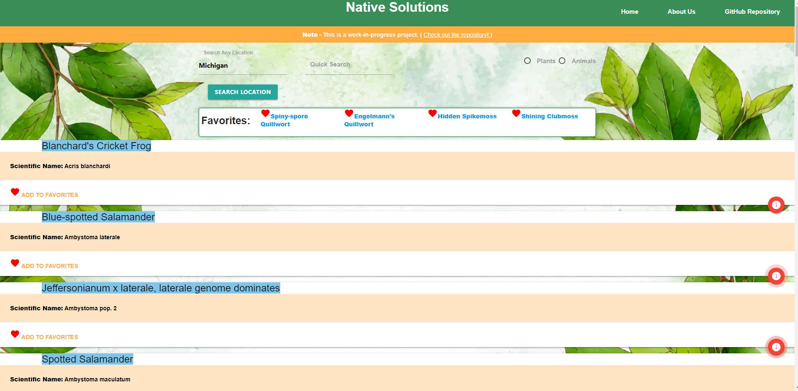
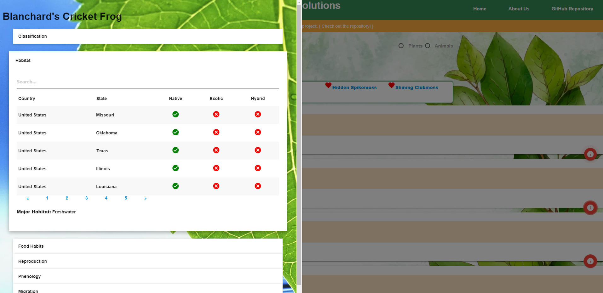

https://docs.google.com/document/d/1S4ZI8fbNBGWyC64NYQ8Jkj39OYtE8VAS5JJ6_j3h9qE/edit?usp=sharing

https://docs.google.com/presentation/d/1nGrTX_2XfR8wvwzwZbxch7p7uk7egDwGDdN2jU5ioLs/edit?usp=sharing

# Native Solutions Project

> By DJ McMillan, Singharaj Usai, Jase Mucene and John Case

## Index

1. [Overview](#overview)
   - [Summary](#summary)
   - [Links](#links)
   - [Screenshots](#screenshots)
   - [Made with](#made-with)

# Overview

A website with a database of information about wildlife in specific zip codes.

## Summary

This project contains a list of information about plants and animals that users can search up by entering a zip code which will use APIs such as Google Maps, USDA Plant Database, NWF, and IUCN Red List to create a database of information for wildlife in that area.

## Links

Live Site URL: https://deejerz88.github.io/Native-Solutions/

Repository URL: https://github.com/Deejerz88/Native-Solutions

## Screenshots

- Initial Search
  - Example of a location only search for the state of Michigan
    
- SideNav
  - Demonstrates SideNav populated with data on selected plant/animal
    

## Made With

- HTML5
- CSS
- Javascript
